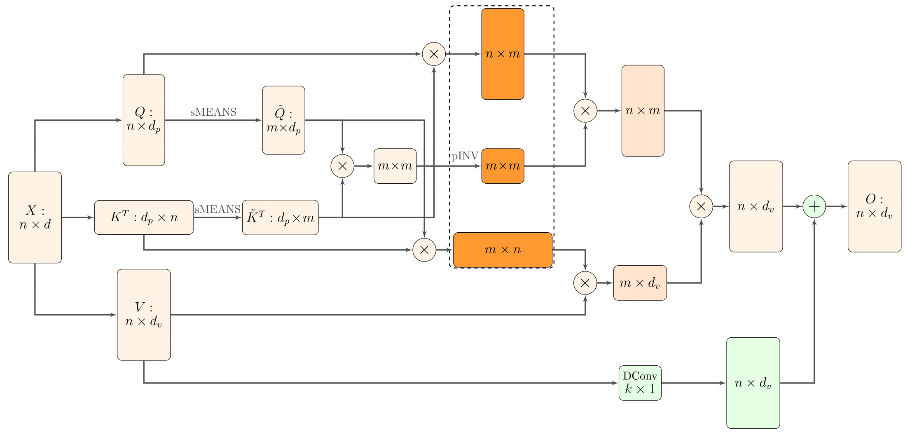

# Nystromformer [](https://twitter.com/intent/tweet?text=Wow:&url=https%3A%2F%2Fgithub.com%2FRishit-dagli%2FNystromformer)


[](https://github.com/Rishit-dagli/Nystromformer/actions/workflows/tests.yml)
[](https://github.com/Rishit-dagli/Nystromformer/actions/workflows/python-publish.yml)
[](https://github.com/psf/black)
[](https://codecov.io/gh/Rishit-dagli/Nystromformer)


[](https://github.com/Rishit-dagli/Nystromformer/stargazers)
[](https://github.com/Rishit-dagli)
[](https://twitter.com/intent/follow?screen_name=rishit_dagli)

An implementation of the [Nyströmformer: A Nyström-Based Algorithm for Approximating Self-Attention](https://arxiv.org/abs/2102.03902) paper by Xiong et al. The self-attention mechanism that encodes the influence or dependence of other tokens on each specific token is a key component of the performance of Transformers. This uses the Nyström method to approximate standard self-attention with O(n) complexity allowing to exhibit scalability as a function of sequence length.



## Installation

Run the following to install:

```sh
pip install nystromformer
```

## Developing nystromformer

To install `nystromformer`, along with tools you need to develop and test, run the following in your virtualenv:

```sh
git clone https://github.com/Rishit-dagli/Nystromformer.git
# or clone your own fork

cd Nystromformer
pip install -e .[dev]
```

To run rank and shape tests run the following:

```
pytest -v --disable-warnings --cov
```

## Usage

### Nystrom Attention

```py
import tensorflow as tf
from nystromformer import NystromAttention

attn = NystromAttention(
    dim = 512,
    dim_head = 64,
    heads = 8,
    num_landmarks = 256,    # number of landmarks
    pinv_iterations = 6,    # number of moore-penrose iterations for approximating pinverse. 6 was recommended by the paper
    residual = True         # whether to do an extra residual with the value or not. supposedly faster convergence if turned on
)

x = tf.random.normal((1, 16384, 512))
mask = tf.ones((1, 16384), dtype=tf.bool)

attn(x, mask = mask) # (1, 16384, 512)
```

### Nystromformer

```py
import tensorflow as tf
from nystromformer import Nystromformer

model = Nystromformer(
    dim = 512,
    dim_head = 64,
    heads = 8,
    depth = 6,
    num_landmarks = 256,
    pinv_iterations = 6
)

x = tf.random.normal((1, 16384, 512))
mask = tf.ones((1, 16384), dtype=tf.bool)

model(x, mask = mask) # (1, 16384, 512)
```

## Want to Contribute 🙋‍♂️?

Awesome! If you want to contribute to this project, you're always welcome! See [Contributing Guidelines](CONTRIBUTING.md). You can also take a look at [open issues](https://github.com/Rishit-dagli/Nystromformer/issues) for getting more information about current or upcoming tasks.

## Want to discuss? 💬

Have any questions, doubts or want to present your opinions, views? You're always welcome. You can [start discussions](https://github.com/Rishit-dagli/Nystromformer/discussions).

## Citation

```bibtex
@misc{xiong2021nystromformer,
    title   = {Nyströmformer: A Nyström-Based Algorithm for Approximating Self-Attention},
    author  = {Yunyang Xiong and Zhanpeng Zeng and Rudrasis Chakraborty and Mingxing Tan and Glenn Fung and Yin Li and Vikas Singh},
    year    = {2021},
    eprint  = {2102.03902},
    archivePrefix = {arXiv},
    primaryClass = {cs.CL}
}
```

[Yannic Kilcher's Video](https://www.youtube.com/watch?v=m-zrcmRd7E4)
[PyTorch Implementation](https://github.com/mlpen/Nystromformer)
[PyTorch Implementation](https://github.com/lucidrains/nystrom-attention)

## License

```
Copyright 2020 Rishit Dagli

Licensed under the Apache License, Version 2.0 (the "License");
you may not use this file except in compliance with the License.
You may obtain a copy of the License at

    http://www.apache.org/licenses/LICENSE-2.0

Unless required by applicable law or agreed to in writing, software
distributed under the License is distributed on an "AS IS" BASIS,
WITHOUT WARRANTIES OR CONDITIONS OF ANY KIND, either express or implied.
See the License for the specific language governing permissions and
limitations under the License.
```
